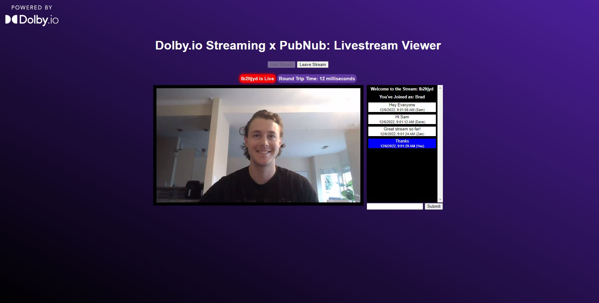

# Building a Low Latency Live Stream Viewer w/ Dolby.io Streaming + PubNub In-App Chat

This code is a suppliment for [this guide here on adding PubNub In-App Chat to a Dolby.io Live Stream App](https://dolby.io/blog/adding-pubnub-in-app-chat-to-your-webrtc-live-stream-app/).

## Branches

**Main**: If you are interested in building a live stream viewer without a chatroom, switch to the main branch of this project.

**Simple-chat**: Current Branch

**Multiviewer**: If you are interested in building a more advanced version of this project that can ingest multiple WebRTC streams [check out this guide here](https://dolby.io/blog/building-a-webrtc-live-stream-multiviewer-app/).

## To Run
The whole project is built in vanilla JS, so just clone the repo and open the index.html file in browser.

Make sure to add your own API keys in the streaming_viewer.js file.

## Learn More:
1. [Dolby.io Streaming](https://dolby.io/products/real-time-streaming/)
2. [PubNub In-App Chat](https://www.pubnub.com/use-case/in-app-chat/)
3. [More Dolby.io Tools](https://dolby.io/)
4. [Dolby.io Streaming Web SDK Documentation](https://docs.dolby.io/streaming-apis/docs/web)
5. [More Streaming Samples and News](https://github.com/millicast/millicast-sdk)

