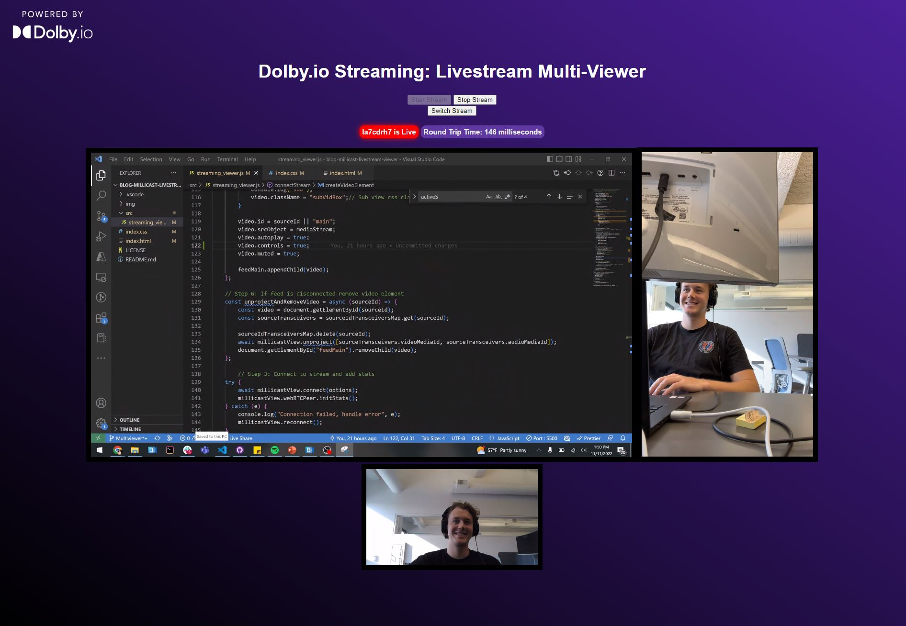

# Dolby.io Streaming Multiview Live Stream App

Interested in building this demo? Read the guide:  [Building a WebRTC Live Stream Multiviewer App in vanilla JS.](https://dolby.io/blog/building-a-webrtc-live-stream-multiviewer-app/) 

## Branches

**Main**: If you are interested in building a live stream viewer without multiview, [switch to the main branch of this project](https://github.com/dolbyio-samples/blog-millicast-livestream-viewer).

**Multiviewer**: Current branch.

## To Run
1. The whole project is built in vanilla JS, so just clone the repo and open the index.html file in browser.

2. In order to stream multiple views to the app you must enabled multisource streams. [Check out this guide here.](https://dolby.io/blog/enabling-multiview-for-dolby-io-livestreaming/)

## Learn More:
1. [Dolby.io Streaming](https://dolby.io/products/real-time-streaming/)
2. [More Dolby.io Tools](https://dolby.io/)
3. [Dolby.io Streaming Web SDK Documentation](https://docs.dolby.io/streaming-apis/docs/web)
4. [More Streaming Samples and News](https://github.com/millicast/millicast-sdk)
5. [The original version of this project](https://github.com/dolbyio-samples/blog-millicast-livestream-viewer)

