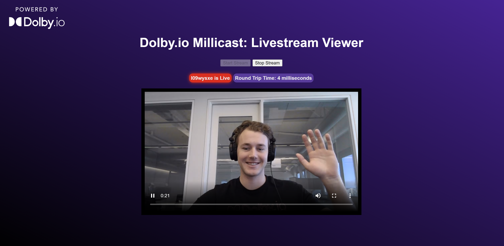

# Dolby.io Millicast Livestream Viewer App

Supplement code for this blog here:

A demo app for viewing an Ultra Low Latency Dolby.io Millicast Livestream in vanilla JS. 

## To Run
The whole project is built in vanilla JS, so just clone the repo and open the index.html file.

## Learn More:
1. [Dolby.io Millicast](https://millicast.com/)
2. [More Dolby.io tools](https://dolby.io/)
3. [Millicast Web SDK Documentation](https://docs.millicast.com/docs/web-draft)
4. [More Millicast Samples and News](https://github.com/millicast/millicast-sdk)

